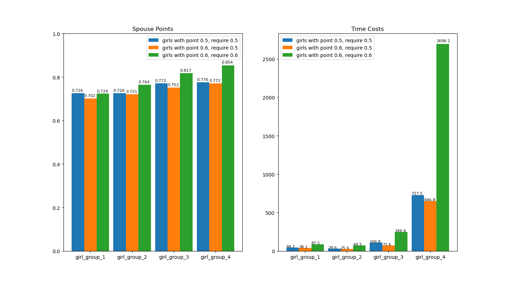
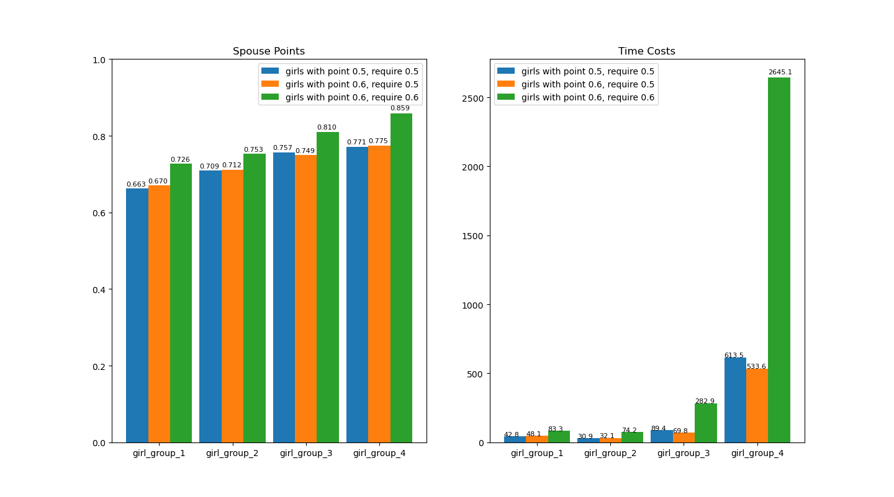
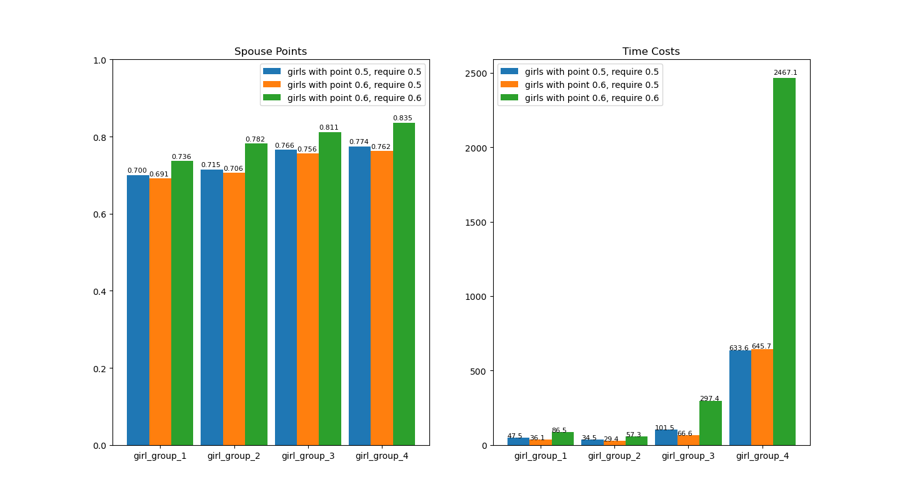
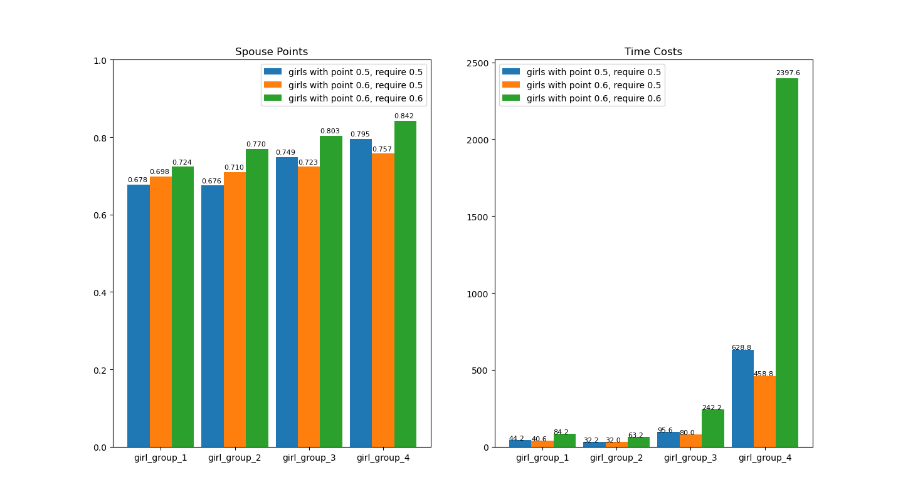

我这里选择展示比较好的若干个结果：

一



```python
[0.615, 0.633, 0.646, 0.661, 0.674, 0.687, 0.694, 0.703, 0.708, 0.713, 0.729, 0.731, 0.735, 0.752, 0.763, 0.774, 0.781, 0.798, 0.824, 0.897] 0.726 44.2
[0.553, 0.575, 0.616, 0.623, 0.643, 0.655, 0.669, 0.674, 0.679, 0.690, 0.695, 0.727, 0.733, 0.734, 0.756, 0.757, 0.761, 0.773, 0.778, 0.948] 0.702 38.1
[0.609, 0.632, 0.659, 0.663, 0.676, 0.677, 0.698, 0.714, 0.722, 0.735, 0.738, 0.738, 0.740, 0.742, 0.742, 0.747, 0.758, 0.799, 0.836, 0.854] 0.724 87.5
[0.623, 0.637, 0.639, 0.649, 0.653, 0.701, 0.705, 0.720, 0.727, 0.734, 0.740, 0.742, 0.744, 0.760, 0.761, 0.767, 0.778, 0.789, 0.821, 0.823] 0.726 29.6
[0.602, 0.639, 0.652, 0.655, 0.669, 0.671, 0.674, 0.679, 0.682, 0.718, 0.723, 0.736, 0.752, 0.755, 0.763, 0.763, 0.775, 0.821, 0.834, 0.860] 0.721 25.6
[0.656, 0.662, 0.683, 0.706, 0.724, 0.732, 0.735, 0.745, 0.761, 0.763, 0.767, 0.771, 0.774, 0.779, 0.805, 0.813, 0.815, 0.815, 0.840, 0.938] 0.764 69.5
[0.630, 0.695, 0.721, 0.727, 0.736, 0.738, 0.739, 0.744, 0.750, 0.769, 0.771, 0.790, 0.793, 0.807, 0.811, 0.818, 0.829, 0.840, 0.842, 0.880] 0.772 106.8
[0.661, 0.681, 0.687, 0.694, 0.700, 0.706, 0.711, 0.718, 0.723, 0.739, 0.750, 0.755, 0.775, 0.782, 0.791, 0.791, 0.815, 0.824, 0.836, 0.891] 0.752 71.6
[0.733, 0.742, 0.756, 0.772, 0.776, 0.776, 0.779, 0.791, 0.793, 0.801, 0.817, 0.836, 0.839, 0.846, 0.856, 0.866, 0.867, 0.874, 0.885, 0.938] 0.817 246.6
[0.692, 0.709, 0.723, 0.730, 0.740, 0.743, 0.747, 0.753, 0.754, 0.762, 0.766, 0.767, 0.776, 0.782, 0.822, 0.831, 0.831, 0.838, 0.873, 0.889] 0.776 727.5
[0.657, 0.683, 0.696, 0.717, 0.731, 0.738, 0.743, 0.749, 0.756, 0.768, 0.770, 0.782, 0.791, 0.796, 0.798, 0.810, 0.812, 0.856, 0.880, 0.897] 0.772 646.8
[0.804, 0.805, 0.813, 0.827, 0.831, 0.838, 0.839, 0.839, 0.841, 0.845, 0.851, 0.856, 0.858, 0.863, 0.864, 0.872, 0.889, 0.894, 0.920, 0.934] 0.854 2696.1
```

二



```python
[0.564, 0.582, 0.597, 0.599, 0.609, 0.616, 0.625, 0.637, 0.641, 0.652, 0.669, 0.678, 0.681, 0.688, 0.709, 0.725, 0.726, 0.736, 0.749, 0.770] 0.663 42.8
[0.527, 0.572, 0.581, 0.601, 0.609, 0.619, 0.625, 0.629, 0.647, 0.655, 0.656, 0.658, 0.675, 0.676, 0.723, 0.725, 0.727, 0.817, 0.837, 0.849] 0.670 48.1
[0.622, 0.671, 0.685, 0.701, 0.701, 0.703, 0.716, 0.718, 0.725, 0.726, 0.729, 0.732, 0.737, 0.738, 0.745, 0.757, 0.763, 0.769, 0.785, 0.808] 0.726 83.3
[0.580, 0.597, 0.626, 0.636, 0.651, 0.659, 0.661, 0.666, 0.681, 0.684, 0.684, 0.705, 0.714, 0.719, 0.733, 0.785, 0.794, 0.847, 0.858, 0.911] 0.709 30.9
[0.602, 0.604, 0.619, 0.636, 0.650, 0.652, 0.658, 0.678, 0.699, 0.710, 0.723, 0.729, 0.730, 0.731, 0.736, 0.753, 0.794, 0.814, 0.842, 0.870] 0.712 32.1
[0.652, 0.699, 0.706, 0.712, 0.716, 0.716, 0.724, 0.732, 0.734, 0.743, 0.748, 0.756, 0.771, 0.783, 0.787, 0.795, 0.810, 0.819, 0.822, 0.828] 0.753 74.2
[0.632, 0.667, 0.668, 0.684, 0.694, 0.699, 0.737, 0.746, 0.746, 0.756, 0.767, 0.775, 0.778, 0.787, 0.798, 0.804, 0.811, 0.831, 0.847, 0.907] 0.757 89.4
[0.665, 0.683, 0.695, 0.697, 0.704, 0.704, 0.707, 0.710, 0.716, 0.733, 0.739, 0.751, 0.761, 0.767, 0.771, 0.791, 0.803, 0.843, 0.849, 0.894] 0.749 69.8
[0.735, 0.737, 0.742, 0.765, 0.771, 0.777, 0.780, 0.794, 0.802, 0.803, 0.826, 0.826, 0.833, 0.840, 0.843, 0.850, 0.852, 0.856, 0.879, 0.890] 0.810 282.9
[0.694, 0.698, 0.715, 0.717, 0.725, 0.727, 0.755, 0.756, 0.758, 0.762, 0.777, 0.778, 0.788, 0.793, 0.803, 0.805, 0.815, 0.831, 0.857, 0.860] 0.771 613.5
[0.669, 0.694, 0.719, 0.721, 0.735, 0.738, 0.751, 0.756, 0.759, 0.762, 0.765, 0.784, 0.801, 0.810, 0.815, 0.820, 0.824, 0.828, 0.853, 0.891] 0.775 533.6
[0.802, 0.821, 0.823, 0.824, 0.832, 0.835, 0.836, 0.838, 0.841, 0.847, 0.847, 0.853, 0.857, 0.859, 0.862, 0.867, 0.907, 0.907, 0.959, 0.959] 0.859 2645.1
```

三



```python
[0.613, 0.623, 0.632, 0.633, 0.643, 0.654, 0.662, 0.674, 0.702, 0.703, 0.709, 0.711, 0.712, 0.715, 0.725, 0.735, 0.740, 0.757, 0.797, 0.864] 0.700 47.5
[0.520, 0.592, 0.611, 0.612, 0.619, 0.630, 0.637, 0.648, 0.672, 0.674, 0.681, 0.696, 0.716, 0.728, 0.732, 0.748, 0.768, 0.834, 0.843, 0.858] 0.691 36.1
[0.629, 0.635, 0.651, 0.656, 0.681, 0.697, 0.698, 0.704, 0.721, 0.723, 0.728, 0.742, 0.758, 0.763, 0.785, 0.787, 0.818, 0.834, 0.851, 0.864] 0.736 86.5
[0.578, 0.583, 0.632, 0.635, 0.659, 0.673, 0.678, 0.679, 0.694, 0.710, 0.724, 0.728, 0.736, 0.748, 0.762, 0.786, 0.789, 0.798, 0.831, 0.877] 0.715 34.5
[0.607, 0.654, 0.656, 0.666, 0.666, 0.669, 0.678, 0.680, 0.684, 0.686, 0.694, 0.694, 0.700, 0.704, 0.708, 0.752, 0.786, 0.789, 0.818, 0.823] 0.706 29.4
[0.669, 0.690, 0.697, 0.716, 0.740, 0.753, 0.754, 0.757, 0.765, 0.769, 0.769, 0.780, 0.801, 0.829, 0.842, 0.846, 0.847, 0.863, 0.870, 0.876] 0.782 57.3
[0.623, 0.662, 0.683, 0.706, 0.719, 0.723, 0.723, 0.762, 0.769, 0.777, 0.778, 0.794, 0.798, 0.801, 0.810, 0.824, 0.824, 0.834, 0.849, 0.852] 0.766 101.5
[0.639, 0.665, 0.671, 0.684, 0.692, 0.694, 0.721, 0.732, 0.742, 0.763, 0.772, 0.787, 0.788, 0.789, 0.790, 0.799, 0.803, 0.824, 0.865, 0.895] 0.756 66.6
[0.754, 0.757, 0.759, 0.764, 0.765, 0.778, 0.782, 0.788, 0.803, 0.803, 0.804, 0.817, 0.820, 0.820, 0.833, 0.855, 0.864, 0.865, 0.884, 0.906] 0.811 297.4
[0.670, 0.689, 0.692, 0.703, 0.718, 0.736, 0.772, 0.772, 0.774, 0.776, 0.781, 0.781, 0.786, 0.799, 0.802, 0.803, 0.815, 0.828, 0.865, 0.919] 0.774 633.6
[0.654, 0.682, 0.684, 0.691, 0.692, 0.719, 0.731, 0.738, 0.738, 0.745, 0.748, 0.766, 0.767, 0.817, 0.819, 0.836, 0.840, 0.840, 0.871, 0.873] 0.762 645.7
[0.786, 0.789, 0.801, 0.805, 0.805, 0.818, 0.819, 0.819, 0.824, 0.837, 0.837, 0.839, 0.839, 0.842, 0.847, 0.853, 0.854, 0.884, 0.886, 0.919] 0.835 2467.1
```

四



```python
[0.532, 0.570, 0.618, 0.621, 0.626, 0.627, 0.656, 0.666, 0.667, 0.677, 0.678, 0.681, 0.709, 0.724, 0.729, 0.730, 0.732, 0.754, 0.770, 0.789] 0.678 44.2
[0.568, 0.605, 0.631, 0.634, 0.652, 0.667, 0.671, 0.680, 0.687, 0.701, 0.704, 0.711, 0.719, 0.732, 0.737, 0.737, 0.738, 0.773, 0.800, 0.823] 0.698 40.6
[0.611, 0.628, 0.648, 0.653, 0.658, 0.701, 0.708, 0.711, 0.719, 0.724, 0.728, 0.734, 0.736, 0.748, 0.748, 0.761, 0.775, 0.789, 0.813, 0.884] 0.724 84.2
[0.559, 0.560, 0.572, 0.610, 0.616, 0.620, 0.624, 0.626, 0.627, 0.676, 0.680, 0.682, 0.694, 0.716, 0.732, 0.738, 0.749, 0.772, 0.831, 0.831] 0.676 32.2
[0.549, 0.613, 0.643, 0.662, 0.664, 0.671, 0.679, 0.685, 0.687, 0.687, 0.700, 0.732, 0.738, 0.743, 0.749, 0.762, 0.777, 0.792, 0.794, 0.868] 0.710 32.0
[0.659, 0.683, 0.697, 0.704, 0.724, 0.725, 0.730, 0.731, 0.756, 0.764, 0.777, 0.781, 0.787, 0.792, 0.797, 0.829, 0.850, 0.859, 0.864, 0.891] 0.770 63.2
[0.663, 0.679, 0.688, 0.694, 0.706, 0.706, 0.709, 0.725, 0.733, 0.751, 0.756, 0.767, 0.774, 0.781, 0.781, 0.786, 0.787, 0.812, 0.817, 0.865] 0.749 95.6
[0.604, 0.604, 0.644, 0.645, 0.659, 0.669, 0.673, 0.687, 0.706, 0.729, 0.739, 0.744, 0.748, 0.760, 0.766, 0.768, 0.775, 0.825, 0.862, 0.865] 0.723 80.0
[0.683, 0.722, 0.740, 0.745, 0.750, 0.759, 0.762, 0.770, 0.787, 0.794, 0.800, 0.819, 0.819, 0.828, 0.854, 0.868, 0.871, 0.883, 0.888, 0.924] 0.803 242.2
[0.681, 0.699, 0.746, 0.757, 0.758, 0.762, 0.768, 0.776, 0.785, 0.790, 0.807, 0.815, 0.819, 0.829, 0.831, 0.833, 0.839, 0.840, 0.888, 0.888] 0.795 628.8
[0.639, 0.680, 0.705, 0.708, 0.712, 0.719, 0.720, 0.724, 0.735, 0.746, 0.759, 0.760, 0.760, 0.770, 0.807, 0.820, 0.836, 0.841, 0.842, 0.862] 0.757 458.8
[0.775, 0.787, 0.795, 0.797, 0.812, 0.816, 0.819, 0.827, 0.832, 0.840, 0.845, 0.845, 0.846, 0.850, 0.875, 0.879, 0.888, 0.896, 0.904, 0.904] 0.842 2397.6
```

